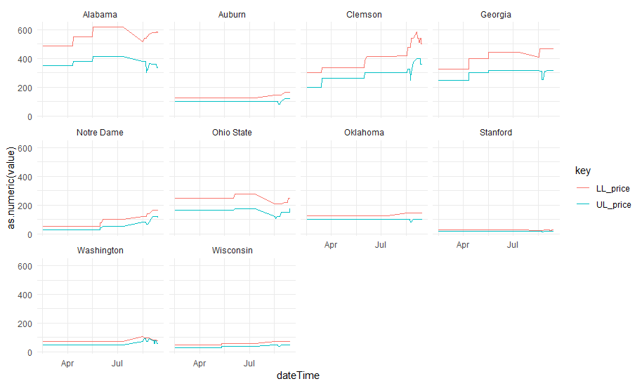

# CFP-RSVP Option Pricing

The College Football Playoff (CFP) championship game is the ultimate goal for every college football program and where the team goes, so does the fan. While teams need a season's worth of good fortune and hardwork to get to the ultimate game, fans need only one thing: money (and a considerable amount of it). For the 2018 championship game, StubHub reported that the average ticket price was \$2,689 on the secondary market. This is in stark contrast to the face value for those tickets, which ranged from \$375 to \$875. To give mere mortal fans a chance to purchase tickets, CFP teamed with OptionIt to host an RSVP system (CFP-RSVP). Fans can purchase an option for any team, at a given price. If that team makes it the championship game, they are given an opportunity to purchase a ticket at face value.

This project started merely as a project to scrape some data from CFP-RSVP -- however, it quickly took a turn towards the silly. Data source changes, code golf, office changes, and computer upgrades threw interesting wrenches in data collection, but we generally feel that we have a unique bit of data aggregated.

# Data

We have pulled data from the following sources:

- [Massey Rankings](https://www.masseyratings.com/cf/compare.htm)

- [Don Best's Injury Page](http://www.donbest.com/ncaaf/injuries/)

- [Odds Shark Computer Picks](https://www.oddsshark.com/ncaaf/computer-picks)

- [CFP-RSVP](https://www.cfp-rsvp.com/home)

The data that we have collected represents just a few things that might be interesting to us. 

# Code

You will find an assortment of code within this repository. If your desire is to start pulling this data on your own, you should probably check out the *teamOptionsPullPrep.R* file in the code folder. This will call the necessary functions (from the functions folder, no less) and take care of almost everything (you will need to handle a little bit of file extension renaming, but you can just throw them into the functions were noted). We firmly believe that code should be available, warts and all, so we have also included all of our data reconciliation code. The clean version is there, but we don't want the world to think that we did this perfectly on the first shot (or the second...or the third...or perhaps ever) -- we aim for full transparency in our research.

# Results

Our results are generally discussed in a highly visual and descriptive manner. That is not to say, though, that we do not engage in some statistical fun. Given the place we currently are within the season, our data is a bit limited. Although limited in data, we still can provide some thoughts towards strategies to buying options.

